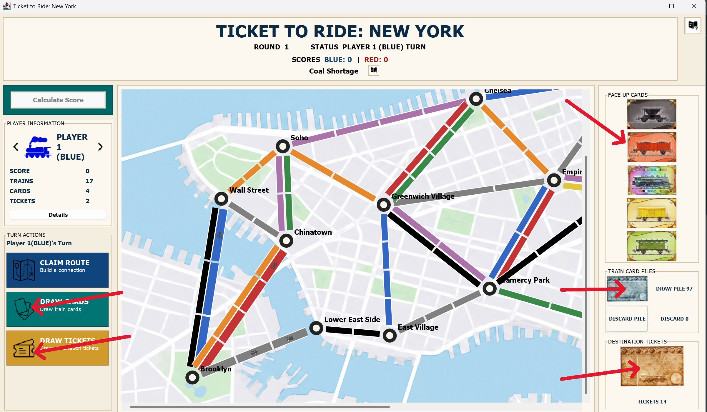

# Ticket to Ride Game

## Requirements

- JDK 17 or newer
- IntelliJ IDEA

## Introduction

This project was a course work for **FIT3077 - Software Engineering: Architecture
and Design**. The intension is to build a structured prototype of the famous board game
**Ticket to Ride** with simple extensions. This project used Java and Java Swing 
and no external library is required. Since the requirement asked for manual tests, 
automated testing frameworks like **Maven** or **Gradle** is not supported.

The project aims to demonstrate the ability to create functional software that abide to
Object-Oriented Programing principles and is easy to extend and debug.

## Game extensions

- **Ferries:** Other than ordinary routes, we have new ferry routes that needs to be claimed
with certain number of wild cards.
- **Dynamic configuration:** players can choose between 2 and 5 players and
  select the London or New York map. 
- **Weather system:** weather changes at the start of each route with different 
effects to route claiming action.

## Design patterns used

- **Command:** used to represent each game action as a separate operation. This
  separates action flow from the interface and makes new actions easier to add.
- **Strategy:** used to apply different route-claiming rules for each weather
  condition. This isolates weather behaviour and avoids large conditional blocks
  in the normal game flow.
- **Factory:** used to create game entities from parsed map data. This centralises
  construction rules and keeps map loading separate from gameplay.
- **Observer:** used to notify interface components when the game state changes.
  This keeps the board, cards, player information, and turns synchronized without
  tightly coupling the interface to game actions.

## Run from IntelliJ

1. Open this repository folder as an IntelliJ project.
2. Open **File > Project Structure > Project** and select a JDK 17 project SDK
   if one is not already configured.
3. Allow IntelliJ to load `ticket_to_ride_game.iml`. The module defines:
   - `src/main/java` as application source code
   - `src/main/assets` as runtime resources
   - `src/test/java` as test source code
4. Select the included **GameLauncher** run configuration and click **Run**.

You can also open `src/main/java/app/GameLauncher.java` and run its `main`
method directly.

## Build an executable JAR

The repository includes an IntelliJ artifact named **Ticket to Ride Game:jar**.
It packages the compiled module, images, map CSV files, and the manifest that
declares `app.GameLauncher` as the main class.

1. Select **Build > Build Project**.
2. Select **Build > Build Artifacts**.
3. Choose **Ticket to Ride Game:jar > Build**.
4. Find the executable at:

   ```text
   build/artifacts/Ticket to Ride Game.jar
   ```

Run the artifact from the repository root:

```powershell
java -jar "build/artifacts/Ticket to Ride Game.jar"
```

## How to play

### Set up the game

1. Launch the application and click **Initialize Game**.
2. Choose between 2 and 5 players.
3. Select the London or New York map, then click **Start Game**.
4. Initialize each player in turn. Every player begins with 17 plastic trains
   and 4 train cards.
5. Each player draws 3 destination tickets and must keep at least 2.

### Take a turn

The available actions appear in the turn panel on the left. On a normal turn,
choose one action:

- **Draw train cards:** draw from the hidden deck or select a face-up card on
  the right. You may normally draw two cards. Taking a face-up locomotive ends
  the draw immediately, and a locomotive cannot be selected as the second card.
- **Draw destination tickets:** draw up to 3 tickets and keep at least 1.
- **Claim a route:** click an available route, then select the required train
  cards. Ferry routes may require locomotives. The route adds points immediately
  and uses the same number of plastic trains as its length.

The right side of the window contains the train-card deck, discard pile,
destination-ticket deck, and face-up cards. Player details and claimed routes
can be inspected from the player summary area.

### Weather effects

Weather changes every round:

- **Normal Round:** routes are claimed normally.
- **Government Subsidy:** after claiming a route, draw one train card; a
  face-up locomotive cannot be selected for this bonus draw.
- **Coal Shortage:** claiming a route costs one additional matching card or
  locomotive.
- **Railway Strike:** routes connected to the strike city cannot be claimed.
- **Industrial Boom:** claiming a route awards 1 additional point.

Use the help buttons in the game window to view the scoring cards and weather
rules.

### End of the game and scoring

The final round begins when a player reaches 2 or fewer plastic trains. Final
scores include claimed-route points, destination-ticket results, and a 10-point
bonus for the longest route.

#### Complete rulebook for the game can be find on [Days of Wonder official site](https://www.daysofwonder.com/game/ticket-to-ride-my-first-journey/)

## Project structure

```text
src/
|-- main/
|   |-- java/app/GameLauncher.java   Application entry point
|   `-- assets/                     Runtime images and map data
`-- test/java/app/                  Manual tests
```

## Preview and UML diagram

### Game preview



### UML diagram


